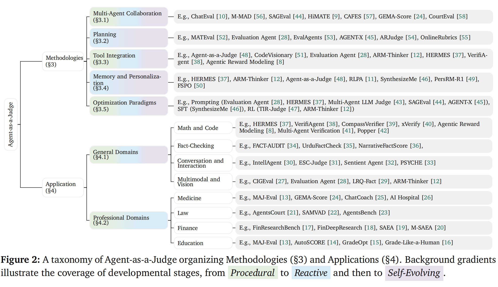

<a name="readme-top"></a>


<div align="center">
    


<p align="center">
    <a href="https://github.com/sindresorhus/awesome"></a>
    <a href="https://github.com/ModalityDance/Awesome-Agent-as-a-Judge/stargazers"></a>
    <a href="LICENSE"></a>
</p>




</div>


Welcome to **Awesome Agent-as-a-Judge**! 👋 This repository provides a collection of papers for **AA Survey on Agent-as-a-Judge**, where LLM-based agents are used as judges to evaluate different types of outputs, including natural language generation, code generation, mathematical reasoning, and more.


## 📑 Table of Contents <span id="table-of-contents">

* <a href='#papers'>📚 Papers</a>
* <a href='#community'>🪴 Acknowledge</a>
* <a href='#citation'> 📖 Citation </a>

## 📚 Papers <span id="papers">


- [2025/12] ARM-Thinker: Reinforcing Multimodal Generative Reward Models with Agentic Tool Use and Visual Reasoning | [paper](https://arxiv.org/abs/2512.05111)
- [2025/11] HiMATE: A Hierarchical Multi-Agent Framework for Machine Translation Evaluation | [paper](https://arxiv.org/abs/2505.16281) | Venue: EMNLP 2025
- [2025/11] HERMES: Towards Efficient and Verifiable Mathematical Reasoning in LLMs. | [paper](https://arxiv.org/abs/2511.1876)
- [2025/11] Large Language Models as User-Agents for Evaluating Task-Oriented-Dialogue Systems . | [paper](https://arxiv.org/abs/2411.09972)
- [2025/01] Incentivizing Agentic Reasoning in LLM Judges via Tool-Integrated Reinforcement Learning | [paper](https://arxiv.org/abs/2510.23038)
- [2025/01] Online Rubrics Elicitation from Pairwise Comparisons | [paper](https://arxiv.org/abs/2510.07284)
- [2025/09] SAMVAD: A Multi-Agent System for Simulating Judicial Deliberation Dynamics in India | [paper](https://arxiv.org/abs/2509.03793)
- [2025/09] AutoSCORE: Enhancing Automated Scoring with Multi-Agent Large Language Models via Structured Component Recognition | [paper](https://arxiv.org/abs/2509.2191)
- [2025/08] PersRM-R1: Enhance Personalized Reward Modeling with Reinforcement Learning | [paper](https://arxiv.org/abs/2508.14076)
- [2025/08] CompassVerifier: A Unified and Robust Verifier for LLMs Evaluation and Outcome Reward | [paper](https://arxiv.org/abs/2508.03686) | Venue: EMNLP 2025
- [2025/07] CourtEval: A courtroom-based multi-agent evaluation framework. | [paper](https://aclanthology.org/2025.findings-acl.1327) | Venue: ACL 2025
- [2025/07] Multi-agent-as-judge: Aligning llm-agent-based automated evaluation with multi-dimensional human evaluation. | [paper](https://arxiv.org/abs/2507.21028)
- [2025/07] FinResearchBench: A Logic Tree based Agent-as-a-Judge Evaluation Framework for Financial Research Agents | [paper](https://arxiv.org/abs/2507.16248) | Venue: ICAIF 2025
- [2025/07] From Tasks to Teams: A Risk-First Evaluation Framework for Multi-Agent LLM Systems in Finance | [paper](https://openreview.net/forum?id=frPFuji3Hz&noteId=w7sDUtTtQU) | Venue: ICML Workshop 2025
- [2025/07] Multi-agent-as-judge: Aligning llm-agent-based automated evaluation with multi-dimensional human evaluation | [paper](https://arxiv.org/abs/2507.21028)
- [2025/06] SynthesizeMe! Inducing Persona-Guided Prompts for Personalized Reward Models in LLMs | [paper](https://arxiv.org/abs/2506.05598) | Venue: ACL 2025
- [2025/05] CAFES: A Collaborative Multi-Agent Framework for Multi-Granular Multimodal Essay Scoring | [paper](https://arxiv.org/abs/2505.13965)
- [2025/05] Teaching Language Models to Evolve with Users: Dynamic Profile Modeling for Personalized Alignment | [paper](https://arxiv.org/abs/2505.15456) | Venue: NeurIPS 2025
- [2025/05] ESC-Judge: A Framework for Comparing Emotional Support Conversational Agents | [paper](https://arxiv.org/abs/2505.12531) | Venue: EMNLP 2025
- [2025/05] Sentient Agent as a Judge: Evaluating Higher-Order Social Cognition | [paper](https://arxiv.org/abs/2505.02847)
- [2025/05] AGENT-X: Adaptive Guideline-based Expert Network for Threshold-free AI-generated teXt detection | [paper](https://arxiv.org/abs/2505.15261)
- [2025/05] UrduFactCheck: An Agentic Fact-Checking Framework for Urdu | [paper](https://arxiv.org/abs/2505.15063) | Venue: EMNLP 2025
- [2025/04] Multi-Agent LLM Judge: automatic personalized LLM judge design for evaluating natural language generation applications | [paper](https://arxiv.org/abs/2504.02867)
- [2025/04] EvalAgent: Discovering Implicit Evaluation Criteria from the Web | [paper](https://arxiv.org/abs/2504.15219) | Venue: COLM 2025
- [2025/04] CodeVisionary: An Agent-based Framework for Evaluating Large Language Models in Code Generation | [paper](https://arxiv.org/abs/2504.13472) | Venue: ASE 2025
- [2025/04] VerifiAgent: a Unified Verification Agent in Language Model Reasoning | [paper](https://arxiv.org/abs/2504.00406) | Venue: EMNLP 2025
- [2025/04] xVerify: Efficient Answer Verifier for Reasoning Model Evaluations | [paper](https://arxiv.org/abs/2504.10481)
- [2025/04] CIGEval: A Unified Agentic Framework for Evaluating Conditional Image Generation | [paper](https://arxiv.org/abs/2504.07046) | Venue: ACL 2025
- [2025/03] GEMA-Score: Granular Explainable Multi-Agent Score for Radiology Report Evaluation | [paper](https://arxiv.org/abs/2503.05347)
- [2025/02] Faithful, Unfaithful or Ambiguous? Multi-Agent Debate with Initial Stance for Summary Evaluation | [paper](https://arxiv.org/abs/2502.08514) | Venue: NAACL 2025
- [2025/02] Standard Benchmarks Fail -- Auditing LLM Agents in Finance Must Prioritize Risk | [paper](https://arxiv.org/abs/2502.15865)
- [2025/02] Multi-Agent Verification: Scaling Test-Time Compute with Multiple Verifiers | [paper](https://arxiv.org/abs/2502.20379) | Venue: COLM 2025
- [2025/02] Popper: Automated Hypothesis Validation with Agentic Sequential Falsifications | [paper](https://arxiv.org/abs/2502.09858) | Venue: ICML 2025
- [2025/02] FinDeepResearch: Evaluating Deep Research Agents in Rigorous Financial Analysis | [paper](https://arxiv.org/abs/2510.13936)
- [2025/02] FSPO: Few-Shot Preference Optimization of Synthetic Preference Data in LLMs Elicits Effective Personalization to Real Users | [paper](https://arxiv.org/abs/2502.19312)
- [2025/02] FACT-AUDIT: An Adaptive Multi-Agent Framework for Dynamic Fact-Checking Evaluation | [paper](https://arxiv.org/abs/2502.17924) | Venue: ACL 2025
- [2025/02] Agentic Reward Modeling: Integrating Human Preferences with Verifiable Correctness Signals. | [paper](https://arxiv.org/abs/2502.19328) | Venue: ACL 2025
- [2025/01] PSYCHE: A Multi-faceted Patient Simulation Framework for Evaluation of Psychiatric Assessment Conversational Agent | [paper](https://arxiv.org/abs/2501.01594)
- [2025/01] IntellAgent: A Multi-Agent Framework for Evaluating Conversational AI Systems | [paper](https://arxiv.org/abs/2501.11067)
- [2025/01] NarrativeFactScore: Agent-as-Judge for Factual Summarization of Long Narratives | [paper](https://arxiv.org/abs/2501.09993) | Venue: EMNLP 2025
- [2024/12] AgentsBench: A Multi-Agent LLM Simulation Framework for Legal Judgment Prediction | [paper](https://arxiv.org/abs/2412.18697)
- [2024/12] Evaluation Agent: Efficient and Promptable Evaluation Framework for Visual Generative Models | [paper](https://arxiv.org/abs/2412.09645) | Venue: ACL 2025
- [2024/12] M-MAD: Multidimensional Multi-Agent Debate for Advanced Machine Translation Evaluation | [paper](https://arxiv.org/abs/2412.20127) | Venue: ACL 2025
- [2024/11] SAGEval: The frontiers of Satisfactory Agent based NLG Evaluation | [paper](https://arxiv.org/abs/2411.16077)
- [2024/01] Agent-as-a-Judge: Evaluate Agents with Agent | [paper](https://arxiv.org/abs/2410.10934) | Venue: ICML 2025
- [2024/01] LRQ-Fact: LLM-Generated Relevant Questions for Multimodal Fact-Checking . | [paper](https://arxiv.org/abs/2410.04616)
- [2024/01] A LLM-Powered Automatic Grading Framework with Human-Level Guidelines Optimization | [paper](https://arxiv.org/abs/2410.02165)
- [2024/05] MATEval: A Multi-Agent Discussion Framework for Advancing Open-Ended Text Evaluation | [paper](https://arxiv.org/abs/2403.19305) | Venue: DASFAA 2024
- [2024/05] Grade Like a Human: Rethinking Automated Assessment with Multi-Agent LLMs | [paper](https://arxiv.org/abs/2405.19694)
- [2024/03] AgentsCourt: Building judicial decision-making agents with court debate simulation and legal knowledge augmentation. | [paper](https://arxiv.org/abs/2403.02959) | Venue: EMNLP 2024
- [2024/02] Ai hospital: Benchmarking large language models in a multi-agent medical interaction simulator | [paper](https://arxiv.org/abs/2402.09742) | Venue: COLING 2025
- [2024/02] Benchmarking Large Language Models on Communicative Medical Coaching: A Dataset and a Novel System | [paper](https://arxiv.org/abs/2402.05547) | Venue: ACL 2024
- [2024/01] ChatEval: Towards Better LLM-based Evaluators through Multi-Agent Debate | [paper](https://arxiv.org/abs/2308.07201) | Venue: ICLR 2024
- [2023/03] Large language models are diverse role-players for summarization evaluation | [paper](https://arxiv.org/abs/2303.15078) | Venue: NLPCC 2023


## 🪴 Acknowledge <span id="community"></span>


We would like to thank the contributors, open-source projects, and research communities whose work made this collection possible. This repository builds upon the excellent research in agent-based evaluation methods. We also acknowledge helpful discussions and support from **Modality Dance Lab** and the open-source community.


<div align="center">

<a href="https://github.com/ModalityDance/Awesome-Agent-as-a-Judge/contributors">
  
</a>

</div>
<!-- Star history chart -->
<a href="https://star-history.com/ModalityDance/Awesome-Agent-as-a-Judge&Date">
  
</a>

</div>


## 📖 **Citation** <span id="citation"></span>


```bibtex
@article{yourproject2025,
  title        = {A Survey on Agent-as-a-Judge},
  author       = {Your Name and Collaborator Name and Others},
  journal      = {arXiv preprint arXiv:{xxxx.xxxxx}},
  year         = {2025}
}
```


<div align="center">

<a href="https://github.com/ModalityDance/Awesome-Agent-as-a-Judge">
  
</a>

<a href="https://github.com/ModalityDance/Awesome-Agent-as-a-Judge/issues">
  
</a>


<br/>
⭐ <b>Thank you for visiting Awesome Agent-as-a-Judge!</b> ⭐

</div>
